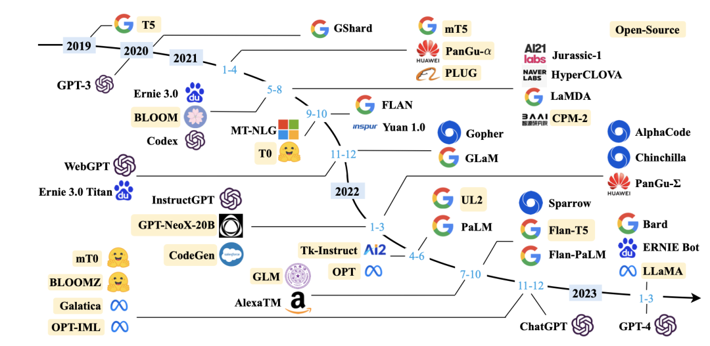
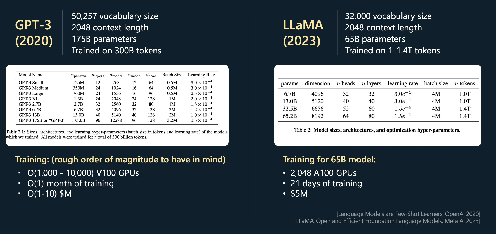
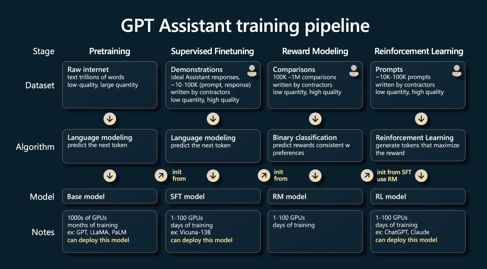
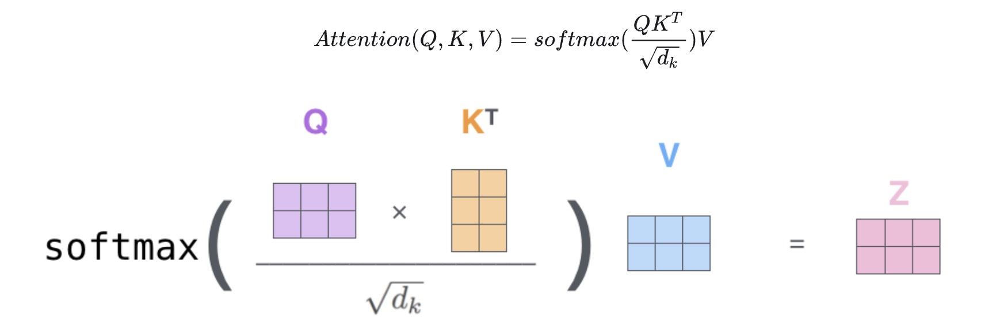

% 大模型训练分析模型
% 姚官磊
% 2024-01-03

# 研究意义

---

## 1 预测训练时间

## 2 训练效率优化分析

在哪些方面可以进行优化？性能的瓶颈在哪里？

## 3 硬件的性能上限

在理想条件下，给定的硬件资源在性能上 的极限是什么？

# 研究内容

## 模型调研

LLaMA

PaLM

## 模型训练

模型训练分为四个阶段：

1. 预训练（Pretraining)  
2. 监督微调（Supervised Finetuning）  
3. 奖励建模（Reward Modeling）  
4. 强化学习（Reinforcement Learning）

---

## 计算量

Transformer 论文：[Attention Is All You Need](https://arxiv.org/abs/1706.03762)

博客文章：[https://jalammar.github.io/illustrated-transformer](https://jalammar.github.io/illustrated-transformer/)

## 内存

## 通信

## 单GPU上

## 多GPU上
